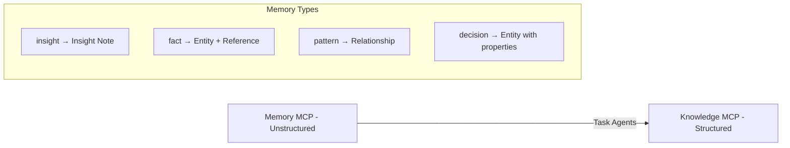

# memory-add

## Purpose

Intelligently capture insights, patterns, and decisions to the memory system.

**Note**: This command captures unstructured memories. For structured knowledge
accumulation (entities, relationships, observations), Task agents should use the
Knowledge MCP instead. See `.claude/mcp_manuals/knowledge_usage_guide.md`.

## Command Pattern

```bash
/memory-add "<content>" [options]
```

## Options

- `--type <type>`: Memory type (auto-detected if not specified)
- `--auto`: Full auto-processing pipeline (default: true)
- `--link`: Link to current issue/PR
- `--confidence <level>`: high|medium|low
- `--topics <list>`: Comma-separated topics

## Memory Types

| Type       | Use Case             | Priority | swarm Integration          |
| ---------- | -------------------- | -------- | -------------------------- |
| `insight`  | New understanding    | High     | Neural pattern discoveries |
| `solution` | Problem fix          | High     | Efficiency improvements    |
| `decision` | Design choice        | Critical | Orchestration strategies   |
| `pattern`  | Recurring approach   | High     | Swarm topology patterns    |
| `error`    | Failure mode         | Medium   | Bottleneck detection       |
| `fact`     | Verified information | Medium   | Performance metrics        |
| `neural`   | swarm patterns       | High     | Learned optimizations      |

## Auto-Processing Pipeline

When `--auto` (default):

### 1. Content Analysis

```yaml
analyze:
  - Identify key concepts
  - Determine memory type
  - Extract entities
  - Assess importance
```

### 2. Context Enhancement

```yaml
enhance:
  - Add current git context
  - Link to active issue/PR
  - Include commit SHA if relevant
  - Add timestamp and metadata
```

### 3. Intelligent Categorization

```yaml
categorize:
  - Generate relevant topics
  - Assign to project
  - Set confidence level
  - Create relationships
```

### 4. Duplicate Prevention

```yaml
check:
  - Search similar memories
  - Merge if duplicate
  - Update if evolution
  - Create if novel
```

## Usage Examples

```bash
# Auto-detect everything
/memory-add "Fixed race condition by adding mutex to Work.status"

# Specific type with metadata
/memory-add "Use pgvector for embeddings under 10M scale" --type decision --confidence high

# Link to current work
/memory-add "GitHub API rate limits reset after 1 hour" --link --type fact

# Pattern with topics
/memory-add "Parallel agent execution reduces time by 80%" --type pattern --topics "orchestration,performance"

# swarm neural patterns
/memory-add "Divergent pattern achieved 92% success on research tasks" --type neural --topics "swarm,patterns"

# Orchestration efficiency
/memory-add "Hierarchical topology with 5 agents: 84.8% efficiency" --type pattern --topics "swarm,orchestration"
```

## Context Linking

Automatic linking per:
`.claude/resources/memory-best-practices.md#repository-context-pattern`

```yaml
auto_metadata:
  repo: "Current repository URL"
  issue: "From git branch or explicit"
  pr: "If PR exists"
  commit: "Latest relevant commit"
  project: "Inferred from repo"
```

## Output Format

### Success

```markdown
## Memory Captured ✅

**Type**: {auto_detected_type} **Topics**: [{topic1}, {topic2}] **Confidence**:
{level} **Memory ID**: {short_id}

### Metadata

- Project: {project}
- Linked to: {issue/pr}
- Commit: {sha}

### Related Memories

- {similar_memory_1}
- {similar_memory_2}

Memory will be available in future sessions.
```

### Duplicate Detected

```markdown
## Similar Memory Found

**Existing**: {existing_memory} **Similarity**: {percentage}%

### Action Taken

✅ Updated existing memory with new context

- Added metadata: {new_metadata}
- Updated topics: {new_topics}

Memory ID: {id}
```

## Smart Detection Rules

### Auto-Type Detection

```yaml
patterns:
  insight: "discovered, realized, learned"
  solution: "fixed, solved, resolved"
  decision: "decided, chose, selected"
  pattern: "always, pattern, approach"
  error: "failed, error, broke"
  neural: "neural, swarm, efficiency, orchestration"
```

### Auto-Topic Generation

```yaml
extract_from:
  - Technology mentions
  - File paths
  - Error types
  - Feature areas
  - Architecture layers
```

## Integration Points

### With session-complete

- Automatically called for key insights
- Batch memory creation
- Linked to session summary
- Captures swarm performance metrics
- Stores neural pattern successes

### With compact-convo

- Extracts memories during compression
- Preserves conversation insights
- Creates memory chains
- Documents orchestration patterns used
- Records swarm efficiency gains

### With KB lifecycle

- Captures research findings
- Documents decisions
- Records implementation insights

### With Knowledge MCP

Memory MCP → Knowledge MCP flow:



Task agents should:

1. Use Memory MCP for quick captures and searches
2. Use Knowledge MCP for structured accumulation:
   - Create entities (normalized, deduplicated)
   - Record observations attached to entities
   - Generate insights linking multiple observations
   - Build queryable knowledge graph

Example migration:

```python
# Memory MCP (quick capture)
mcp__memory__save("Tokio uses work-stealing", type="fact")

# Knowledge MCP (structured)
ref_id = mcp__knowledge__create_reference("Tokio Docs", "Documentation", agent_id)
entity_id = mcp__knowledge__create_entity("Tokio", "Technology", agent_id, references=[ref_id])
mcp__knowledge__observe("Uses work-stealing scheduler", entity_id=entity_id)
```

## References

- Memory best practices: `.claude/resources/memory-best-practices.md`
- Memory MCP manual: `.claude/mcp_manuals/memory.md`

## Metrics

- Auto-detection accuracy: >90%
- Duplicate prevention: 95%
- Context linking: 100%
- Processing time: <5s
- swarm pattern capture: 100%
- Neural learning integration: Automatic
