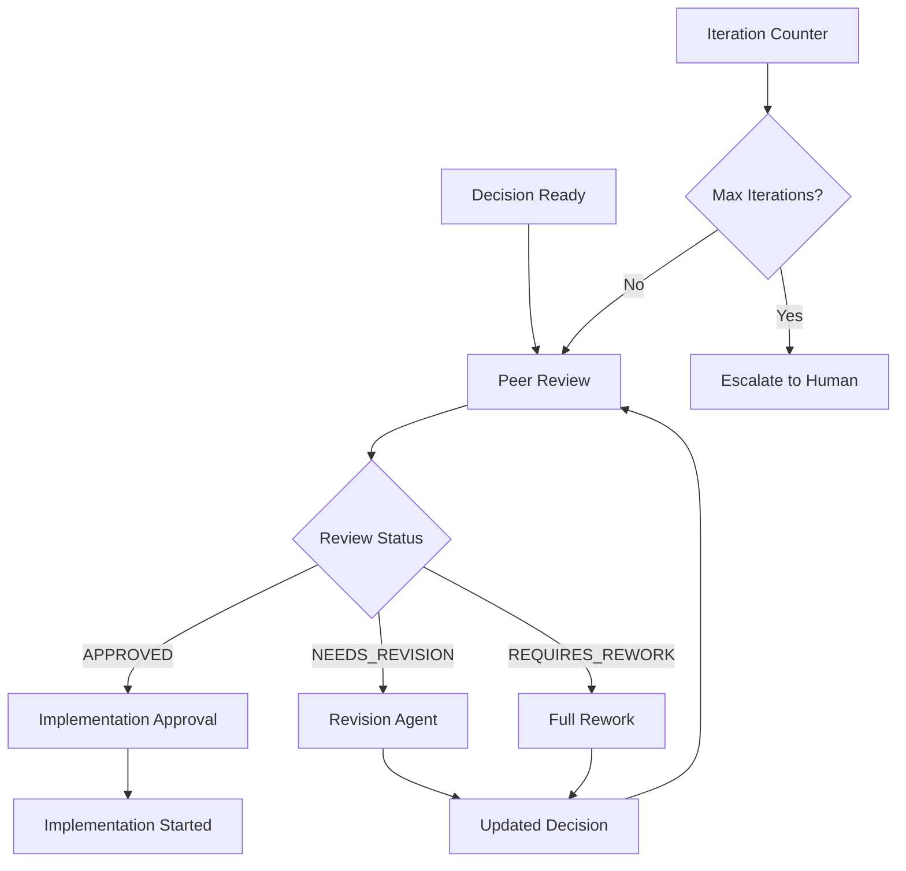

# KB Decision Review Swarm

## Overview

Implements the iterative decision review loop with quality gates, ensuring
decisions meet standards before implementation approval.

## Swarm Configuration

```yaml
swarm:
  name: kb_decision_review_swarm
  type: adaptive
  pattern: iterative_refinement
  max_duration: 45m
  max_iterations: 3

  trigger:
    event: issue.labeled
    label: "stage:decision.ready"

  phases:
    - name: initial_review
      type: sequential
      agents:
        - peer_review_agent
      timeout: 20m

    - name: revision_check
      type: conditional
      condition: |
        if review.status == "APPROVED":
          goto: approve_implementation
        elif review.status == "NEEDS_REVISION":
          goto: revision_phase
        else:
          goto: major_rework

    - name: revision_phase
      type: sequential
      agents:
        - decision_revision_agent
      dependencies: [revision_check]
      timeout: 15m
      next: initial_review # Loop back

    - name: major_rework
      type: sequential
      agents:
        - decision_synthesis_agent # Full recreation
      dependencies: [revision_check]
      timeout: 30m
      next: initial_review

    - name: approve_implementation
      type: sequential
      agents:
        - implementation_approval_agent
      dependencies: [revision_check]
      timeout: 5m
```

## Agent Assignments

### Initial Review Phase

#### Peer Review Agent

```yaml
assignment:
  agent: peer_review_agent
  inputs:
    decision_document: ${get_decision_doc(research_id)}
    research_id: ${research_id}
    urgency: ${issue.priority}
    focus_areas: ${extract_concerns(issue.comments)}
  outputs:
    - review_report.md
    - review_checklist.yaml
    - required_changes.yaml
  validation:
    - review_status in ["APPROVED", "NEEDS_REVISION", "REQUIRES_REWORK"]
```

### Revision Phase

#### Decision Revision Agent

```yaml
assignment:
  agent: decision_revision_agent # Specialized revision agent
  inputs:
    original_decision: ${decision_document}
    review_feedback: ${review_report}
    required_changes: ${required_changes}
  outputs:
    - revised_decision.md
    - revision_summary.yaml
  constraints:
    - preserve_core_recommendation # Unless explicitly rejected
    - address_all_high_priority_issues
    - maintain_decision_structure
```

### Major Rework Phase

#### Decision Synthesis Agent (Rework Mode)

```yaml
assignment:
  agent: decision_synthesis_agent
  mode: complete_rework
  inputs:
    research_summary: ${get_research_findings(research_id)}
    failed_decision: ${decision_document}
    review_feedback: ${review_report}
    constraints: ${extract_hard_requirements(review)}
  outputs:
    - new_decision.md
    - decision_rationale.yaml
```

### Approval Phase

#### Implementation Approval Agent

```yaml
assignment:
  agent: implementation_approval_agent # Simple processor
  inputs:
    approved_decision: ${decision_document}
    review_report: ${review_report}
  outputs:
    - approval_record.yaml
    - implementation_ready.md
  actions:
    - update_issue_labels
    - notify_implementation_team
    - create_implementation_issue
```

## Execution Flow



## Iteration Management

```python
async def execute_review_loop(decision_doc, max_iterations=3):
    """Execute the iterative review loop"""
    
    iteration = 0
    current_doc = decision_doc
    
    while iteration < max_iterations:
        # Review phase
        review = await peer_review_agent.review(current_doc)
        
        # Check status
        if review.status == "APPROVED":
            return await approve_implementation(current_doc, review)
            
        elif review.status == "NEEDS_REVISION":
            # Minor revision
            current_doc = await decision_revision_agent.revise(
                current_doc, 
                review.feedback
            )
            
        else:  # REQUIRES_REWORK
            # Major rework
            current_doc = await decision_synthesis_agent.recreate(
                research_id,
                review.feedback
            )
        
        iteration += 1
        
        # Save iteration state
        await save_iteration_state(iteration, current_doc, review)
    
    # Max iterations reached
    return await escalate_to_human(current_doc, review_history)
```

## Quality Gates

```yaml
review_quality_gates:
  decision_clarity:
    - Clear recommendation stated
    - Rationale complete and logical
    - Addresses original question

  evidence_quality:
    - All claims have supporting data
    - Confidence levels justified
    - Sources properly cited

  implementation_feasibility:
    - Plan is actionable
    - Resources identified
    - Timeline realistic

  risk_management:
    - Major risks identified
    - Mitigations defined
    - Contingencies planned

approval_criteria:
  all_gates_passed: true
  minimum_score: 0.8
  no_critical_issues: true
  stakeholder_alignment: verified
```

## Output Actions

```yaml
on_approval:
  - action: update_issue
    add_labels:
      - "stage:implementation.approved"
      - "decision:approved"
    remove_labels:
      - "stage:decision.ready"
      - "needs-revision"
    comment: |
      ✅ Decision approved after ${iteration_count} review(s)
      Implementation can proceed.

  - action: create_implementation_issue
    title: "Implement: ${decision.title}"
    body: ${generate_implementation_issue(decision)}
    labels: ["stage:implementation.planned"]

  - action: update_knowledge_graph
    entity:
      type: decision
      id: decision_${research_id}
      properties:
        status: approved
        approval_date: ${now()}
        review_iterations: ${iteration_count}

on_max_iterations:
  - action: escalate_issue
    add_labels: ["needs-human-review", "blocked"]
    assignees: ${decision_makers}
    comment: |
      ⚠️ Decision review requires human intervention
      Iterations: ${iteration_count}
      Latest status: ${review.status}
      Key issues: ${review.critical_issues}
```

## Performance Metrics

| Metric                | Target | Typical |
| --------------------- | ------ | ------- |
| First Review          | <20m   | 15m     |
| Revision Cycle        | <15m   | 10m     |
| Total Duration        | <45m   | 25-35m  |
| Approval Rate (1st)   | >60%   | 65%     |
| Approval Rate (Total) | >95%   | 97%     |

## Error Handling

```yaml
error_strategies:
  review_timeout:
    strategy: use_partial_review
    action: flag_incomplete_sections

  revision_failure:
    strategy: escalate_to_human
    action: provide_context_and_issues

  circular_feedback:
    strategy: detect_and_break
    action: synthesize_requirements
```

## Review Patterns

### Common Revision Triggers

1. **Missing Evidence**: Add supporting data
2. **Unclear Rationale**: Expand explanation
3. **Incomplete Risk Assessment**: Add mitigation plans
4. **Unrealistic Timeline**: Adjust estimates
5. **Budget Concerns**: Provide alternatives

### Revision Strategies

```python
def apply_revision_strategy(issue_type, original_doc):
    strategies = {
        "missing_evidence": add_supporting_data,
        "unclear_rationale": expand_explanation,
        "risk_gaps": enhance_risk_section,
        "timeline_issues": recalculate_timeline,
        "budget_concerns": add_cost_alternatives
    }
    
    return strategies[issue_type](original_doc)
```
