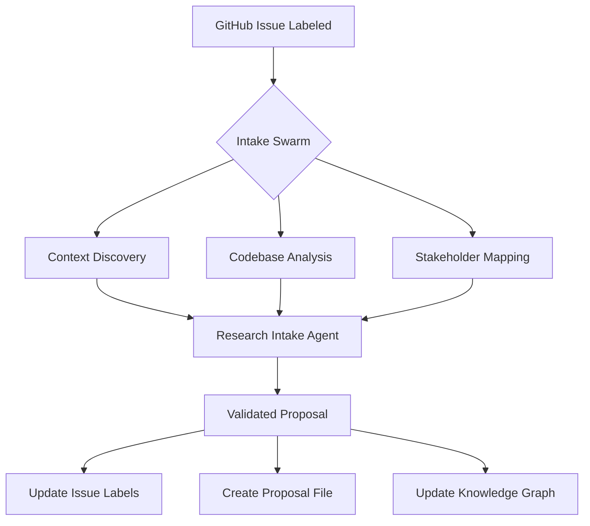

# KB Intake Swarm

## Overview

Processes new research requests from GitHub issues into validated, structured
proposals using parallel agent execution.

## Swarm Configuration

```yaml
swarm:
  name: kb_intake_swarm
  type: parallel
  pattern: parallel_discovery
  max_duration: 15m

  trigger:
    event: issue.labeled
    label: "stage:research.requested"

  phases:
    - name: discovery
      type: parallel
      agents:
        - context_discovery_agent
        - codebase_analyst_agent
        - stakeholder_mapper_agent
      batch_size: 50
      timeout: 10m

    - name: synthesis
      type: sequential
      agents:
        - research_intake_agent
      dependencies: [discovery]
      timeout: 5m
```

## Agent Assignments

### Phase 1: Discovery (Parallel)

#### Context Discovery Agent

```yaml
assignment:
  agent: context_discovery_agent
  inputs:
    topic: ${issue.title}
    keywords: ${extract_keywords(issue.body)}
    scope: [codebase, memory, knowledge_graph]
  outputs:
    - relevant_context.yaml
    - similar_past_work.md
```

#### Codebase Analyst Agent

```yaml
assignment:
  agent: codebase_analyst_agent
  inputs:
    keywords: ${extract_keywords(issue.body)}
    focus_areas: [patterns, dependencies, implementation]
  outputs:
    - existing_implementations.md
    - technical_constraints.yaml
```

#### Stakeholder Mapper Agent

```yaml
assignment:
  agent: stakeholder_mapper_agent # Simple analyzer, not a full agent
  inputs:
    issue_data: ${issue}
    mentions: ${issue.mentions}
  outputs:
    - stakeholders.yaml
    - decision_makers.yaml
```

### Phase 2: Synthesis (Sequential)

#### Research Intake Agent

```yaml
assignment:
  agent: research_intake_agent
  inputs:
    issue_data: ${issue}
    discovery_results: ${phase.discovery.outputs}
  outputs:
    - research_proposal.yaml
    - proposal_summary.md
  validation: ResearchProposal # Pydantic model
```

## Execution Flow



## Output Actions

```yaml
on_success:
  - action: create_file
    path: proposals/${research_id}.md
    content: ${proposal}
    
  - action: update_issue
    add_labels: 
      - "stage:research.proposed"
      - "category:${proposal.category}"
      - "priority:${proposal.priority}"
    remove_labels:
      - "stage:research.requested"
    comment: |
      Research proposal created: ${proposal.research_id}
      Category: ${proposal.category}
      Priority: ${proposal.priority}
      Estimated effort: ${proposal.estimated_effort}
      
  - action: update_knowledge_graph
    entity:
      type: research_project
      id: ${proposal.research_id}
      properties: ${proposal}
      relationships:
        - [requested_by, ${proposal.requestor}]
        - [addresses, ${identified_concepts}]
        
  - action: notify_stakeholders
    template: proposal_ready
    recipients: ${proposal.stakeholders}
```

## Error Handling

```yaml
error_strategies:
  agent_timeout:
    strategy: continue_with_errors
    action: use_partial_results

  validation_failure:
    strategy: retry_with_revision
    max_retries: 2

  insufficient_context:
    strategy: request_clarification
    action: add_comment_to_issue
```

## Performance Metrics

| Metric           | Target | Typical |
| ---------------- | ------ | ------- |
| Total Duration   | <15m   | 10-12m  |
| Discovery Phase  | <10m   | 7-8m    |
| Synthesis Phase  | <5m    | 2-3m    |
| Proposal Quality | >95%   | 97%     |

## Integration Code

```python
async def execute_intake_swarm(issue_data):
    """Execute the intake swarm for a new research request"""
    
    # Phase 1: Parallel discovery
    discovery_tasks = [
        Task("Execute context discovery for issue", 
             context_discovery_agent, 
             {"topic": issue_data.title}),
        Task("Analyze codebase for patterns", 
             codebase_analyst_agent,
             {"keywords": extract_keywords(issue_data.body)}),
        Task("Map stakeholders and decision makers",
             stakeholder_mapper_agent,
             {"issue": issue_data})
    ]
    
    discovery_results = await parallel_execute(discovery_tasks)
    
    # Phase 2: Synthesis
    proposal = await research_intake_agent.process({
        "issue_data": issue_data,
        "discovery_results": discovery_results
    })
    
    # Validate
    validated = ResearchProposal.model_validate(proposal)
    
    # Execute output actions
    await execute_output_actions(validated)
    
    return validated
```

## Quality Gates

- Discovery phase must find at least 3 relevant items
- Proposal must pass Pydantic validation
- All required fields must be populated
- Confidence level must be medium or high
- At least one stakeholder must be identified
