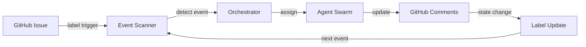

# GitHub Tracking System Guide

## Overview

The KB system uses GitHub as its primary event queue and communication platform.
This guide explains how to set up and use the GitHub tracking system
effectively.

## Quick Setup (2 minutes)

### 1. Required Labels

Create these labels in your repository:

```bash
# Stage labels (for lifecycle tracking)
gh label create "stage:research.requested" --color "0052CC" --description "New research request"
gh label create "stage:research.proposed" --color "5319E7" --description "Proposal created"
gh label create "stage:research.active" --color "0E8A16" --description "Research in progress"
gh label create "stage:decision.ready" --color "FBCA04" --description "Ready for decision"
gh label create "stage:decision.review" --color "E99695" --description "Under review"
gh label create "stage:implementation.started" --color "D93F0B" --description "Being implemented"
gh label create "stage:metrics.collection" --color "C2E0C6" --description "Collecting metrics"
gh label create "stage:metrics.review" --color "BFDADC" --description "Analyzing ROI"
gh label create "stage:knowledge.captured" --color "D4C5F9" --description "Complete"

# Priority labels
gh label create "priority:high" --color "D93F0B" --description "Urgent priority"
gh label create "priority:medium" --color "FBCA04" --description "Standard priority"
gh label create "priority:low" --color "0E8A16" --description "Low priority"

# Status labels
gh label create "status:in-progress" --color "1D76DB" --description "Actively working"
gh label create "status:blocked" --color "E4E669" --description "Blocked by dependency"
gh label create "status:needs-info" --color "D876E3" --description "Requires clarification"

# Category labels
gh label create "category:AIO" --color "F9D0C4" --description "AI/Automation/Optimization"
gh label create "category:MEM" --color "FEF2C0" --description "Memory/Knowledge/Learning"
gh label create "category:TLI" --color "C5DEF5" --description "Tools/Languages/Infrastructure"
gh label create "category:ARC" --color "BFD4F2" --description "Architecture/Design/Patterns"
gh label create "category:DEV" --color "D2DAE1" --description "Development/Process/Quality"
gh label create "category:UXP" --color "E7E7E7" --description "User Experience/Product"
```

### 2. Issue Templates

Copy templates from `.claude/resources/github-templates/` to
`.github/ISSUE_TEMPLATE/`:

```bash
cp .claude/resources/github-templates/research-request.yml .github/ISSUE_TEMPLATE/
cp .claude/resources/github-templates/issue-template-config.yml .github/ISSUE_TEMPLATE/config.yml
```

### 3. Project Board (Optional)

Create a project board for visual tracking:

```bash
gh project create "KB Research Pipeline" --public
```

## How It Works

### Event Flow



### Label-Driven State Machine

Each research request progresses through stages via label changes:

1. **User creates issue** → Auto-labeled `stage:research.requested`
2. **Intake agent processes** → Updates to `stage:research.proposed`
3. **Plan approved** → Changes to `stage:research.active`
4. **Research complete** → Moves to `stage:decision.ready`
5. ...continues through lifecycle

### Agent Communication

Agents communicate via GitHub comments with signatures:

```markdown
[AGENT-ID-2024-01-15T10:30:00Z] Status Update

**Current Activity**: Analyzing codebase **Progress**: 45% complete **Next
Update**: In 30 minutes

### Findings So Far

- Discovery 1
- Discovery 2
```

## Tracking Patterns

### 1. Simple Status Check

View all active research:

```bash
gh issue list --label "stage:research.active"
```

### 2. Priority Queue

High-priority items needing attention:

```bash
gh issue list --label "priority:high" --label "status:blocked"
```

### 3. Weekly Progress

Research completed this week:

```bash
gh issue list --label "stage:knowledge.captured" --state closed --limit 10
```

### 4. ROI Dashboard

Track implementation success:

```bash
gh issue list --label "stage:metrics.review" --json number,title,labels
```

## Automation Workflows

### GitHub Actions Integration

Create `.github/workflows/kb-events.yml`:

```yaml
name: KB Event Processing

on:
  issues:
    types: [opened, labeled, unlabeled]
  issue_comment:
    types: [created]

jobs:
  process-event:
    runs-on: ubuntu-latest
    steps:
      - name: Check KB Event
        uses: actions/github-script@v6
        with:
          script: |
            const labels = context.payload.issue.labels.map(l => l.name);
            const hasStageLabel = labels.some(l => l.startsWith('stage:'));

            if (hasStageLabel) {
              // Trigger KB system processing
              console.log('KB Event detected:', labels);
              // Add your integration here
            }
```

### Webhook Integration

For real-time processing, set up webhooks:

1. **Repository Settings** → **Webhooks** → **Add webhook**
2. **Payload URL**: `https://your-kb-system.com/webhook`
3. **Events**: Issues, Issue comments, Pull requests
4. **Content type**: `application/json`

## Best Practices

### 1. Label Hygiene

- **One stage label** per issue at any time
- **Remove old stage** when adding new one
- **Keep priority current** as importance changes

### 2. Comment Structure

Always use structured comments for automated parsing:

```markdown
[AGENT-ID-TIMESTAMP] Title

**Status**: ✅ Complete | 🔄 In Progress | ❌ Failed **Key Field**: Value

### Section

Content with proper markdown
```

### 3. Issue Linking

Cross-reference related work:

```markdown
Related to: #123, #456 Blocks: #789 Implements: decision from #234
```

### 4. Metrics in Comments

Post metrics in machine-readable format:

```yaml
metrics:
  - metric: "response_time"
    value: 45
    unit: "ms"
    timestamp: "2024-01-15T10:30:00Z"
```

## Search Queries

### Power Searches

Find specific patterns:

```bash
# Failed research attempts
gh issue list --search "label:stage:decision.ready label:status:blocked"

# High-ROI implementations
gh issue list --search "label:roi:high in:comments 'ROI: >200%'"

# Stale research
gh issue list --search "label:stage:research.active updated:<2023-12-01"
```

### Custom Aliases

Add these to your shell profile:

```bash
alias kb-active='gh issue list --label "stage:research.active"'
alias kb-blocked='gh issue list --label "status:blocked"'
alias kb-decisions='gh issue list --label "stage:decision.ready"'
alias kb-roi='gh issue list --label "stage:metrics.review"'
```

## Monitoring & Alerts

### Slack Integration

```javascript
// GitHub Action to post to Slack
if (labels.includes("priority:high") && labels.includes("status:blocked")) {
  await postToSlack({
    text: `🚨 High-priority research blocked: ${issue.title}`,
    url: issue.html_url,
  });
}
```

### Email Notifications

Configure watch settings for:

- All activity on `priority:high` issues
- State changes (label modifications)
- Agent comments with your mention

## Troubleshooting

### Common Issues

**"Agent comments not appearing"**

- Check agent has write permissions
- Verify GitHub token is valid
- Ensure rate limits not exceeded

**"Labels not triggering events"**

- Confirm webhook is active
- Check event scanner is running
- Verify label names match exactly

**"Can't find old research"**

- Use advanced search with date ranges
- Check closed issues
- Search in comments for details

## Advanced Features

### 1. Bulk Operations

Update multiple issues:

```bash
gh issue list --label "stage:research.active" --json number --jq '.[].number' | \
  xargs -I {} gh issue edit {} --add-label "needs:review"
```

### 2. Export for Analysis

Export research data:

```bash
gh issue list --label "stage:knowledge.captured" --json number,title,createdAt,closedAt,labels > research-completed.json
```

### 3. Custom Dashboards

Create dashboard using GitHub API:

```javascript
const stages = ["requested", "proposed", "active", "decision.ready"];
const counts = await Promise.all(
  stages.map((stage) =>
    github.issues.listForRepo({
      labels: `stage:research.${stage}`,
      state: "open",
    }).then((r) => ({ stage, count: r.data.length }))
  ),
);
```

## Integration Examples

### With Memory System

```javascript
// When issue closes, capture to memory
if (action === "closed" && labels.includes("stage:knowledge.captured")) {
  const insights = extractInsights(issue.body + comments);
  await memorySystem.save({
    content: insights,
    type: "insight",
    metadata: {
      issue: issue.number,
      research_id: extractResearchId(issue),
      roi: extractROI(comments),
    },
  });
}
```

### With Notification System

```python
# Python webhook handler
@app.route('/webhook', methods=['POST'])
def handle_webhook():
    event = request.json
    
    if event['action'] == 'labeled':
        label = event['label']['name']
        
        if label.startswith('stage:'):
            notify_team(f"Research {event['issue']['number']} moved to {label}")
            
        if label == 'priority:high':
            escalate_to_management(event['issue'])
```

## Quick Reference Card

| Action         | Command/Label                               |
| -------------- | ------------------------------------------- |
| Start research | Create issue with `research-request` label  |
| Check active   | `gh issue list -l "stage:research.active"`  |
| View blocked   | `gh issue list -l "status:blocked"`         |
| See decisions  | `gh issue list -l "stage:decision.ready"`   |
| Track ROI      | `gh issue list -l "stage:metrics.review"`   |
| Find by ID     | `gh issue view {number}`                    |
| Update stage   | Remove old stage label, add new one         |
| Add priority   | `gh issue edit {number} -l "priority:high"` |

---

**Remember**: GitHub is your single source of truth. All research, decisions,
and outcomes are tracked here for full auditability and knowledge preservation.
