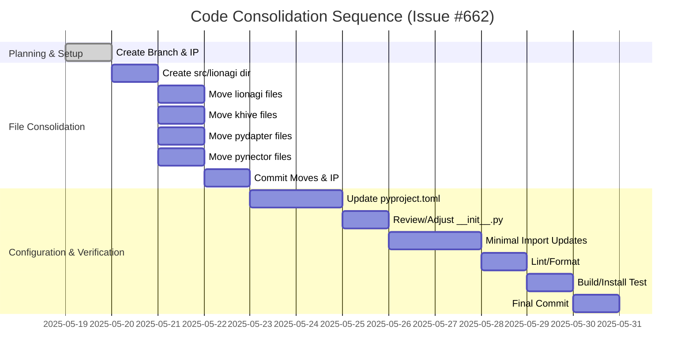

# Guidance

**Purpose**
Plan out the entire coding effort before writing code. Clarify **phases**,
**tasks**, dependencies, test strategy, and acceptance criteria.

**When to Use**
- After design is approved, before actual implementation starts.

**Best Practices**
- Include TDD approach details (e.g., required test coverage).
- Provide a clear sequence of tasks.
- Reference external docs or prior designs.

---

# Implementation Plan: Consolidate Code into src/lionagi (Issue #662)

## 1. Overview

### 1.1 Component Purpose
The purpose of this effort is to consolidate the Python source code from various subdirectories within the `libs/` folder (`libs/lionagi/src/lionagi`, `libs/khive/src/khive`, `libs/pydapter/src/pydapter`, and `libs/pynector/src/pynector`) into a new, unified directory structure under `src/lionagi/` at the repository root. This aims to improve code organization, simplify dependency management, and streamline the build and packaging process for the `lionagi` project.

### 1.2 Design Reference
- GitHub Issue #662: [Consolidate all code from `libs/*` into `src/lionagi/`](https://github.com/khive-ai/lionagi/issues/662)
- Orchestrator's Memo (summarized in Issue #662): Focus on co-location first, refactoring later.

### 1.3 Implementation Approach
The primary approach is "co-location first," as directed. This means moving the existing codebases into the new `src/lionagi/` structure with minimal immediate refactoring of the code itself. The main tasks will involve:
1.  Creating the new directory structure.
2.  Physically moving the files.
3.  Updating `pyproject.toml` (and potentially other configuration files) to recognize the new locations of the packages.
4.  Ensuring basic project integrity (e.g., imports can be resolved, the project can be built/installed).
Extensive refactoring or changes to internal logic are out of scope for this initial consolidation phase.

## 2. Implementation Phases

### 2.1 Phase 1: Planning & Setup
_Description:_ Define the implementation strategy, create the necessary tracking documents (this IP), and set up the development branch.
**Key Deliverables:**
- Approved Implementation Plan (this document: `IP-662.md`).
- Feature branch `feature/662-consolidate-src` created.
**Dependencies:**
- GitHub Issue #662.
- Orchestrator's guidance.
**Estimated Complexity:** Low
*(This phase is largely complete)*

### 2.2 Phase 2: File Consolidation & Initial Commit
_Description:_ Create the target directory structure within `src/lionagi/` and move the source files from their current locations in `libs/` to their new locations.
**Proposed new structure within `src/lionagi/`:**
- `src/lionagi/lionagi/` (from `libs/lionagi/src/lionagi/`)
- `src/lionagi/khive/` (from `libs/khive/src/khive/`)
- `src/lionagi/pydapter/` (from `libs/pydapter/src/pydapter/`)
- `src/lionagi/pynector/` (from `libs/pynector/src/pynector/`)
**Key Deliverables:**
- All specified source code files moved from `libs/*` subdirectories to the new `src/lionagi/` subdirectories.
- Initial commit of the moved files and this IP document to the feature branch.
**Dependencies:**
- Completion of Phase 1.
**Estimated Complexity:** Medium (due to the number of files and potential for oversight)

### 2.3 Phase 3: Configuration Updates
_Description:_ Update project configuration files, primarily `pyproject.toml` (both at the root and potentially within the moved packages if they have their own that need adjustment for relative paths, though the goal is one primary `pyproject.toml` for `lionagi`). This includes ensuring Python can discover and import the moved packages correctly.
**Key Deliverables:**
- Updated `pyproject.toml` reflecting the new source layout.
- Verification that Python can import modules from the new locations.
**Dependencies:**
- Completion of Phase 2.
**Estimated Complexity:** Medium

### 2.4 Phase 4: Basic Verification & Path Adjustments
_Description:_ Perform basic checks to ensure the project builds and essential functionalities are not obviously broken due to path changes. This may involve running linters, formatters, and any readily available tests. Adjust import paths within the moved code if absolutely necessary for basic operation, but defer major refactoring.
**Key Deliverables:**
- Project successfully builds/installs with the new structure.
- Linters/formatters pass on the moved code.
- Critical import paths updated if broken by the move.
**Dependencies:**
- Completion of Phase 3.
**Estimated Complexity:** Medium

## 3. Test Strategy

Given the "co-location first" approach, the immediate test strategy is focused on ensuring existing tests can still be discovered and run after the move, and that the project remains structurally sound.
### 3.1 Unit Tests
- **Goal:** Ensure existing unit tests within each of the moved packages (`lionagi`, `khive`, `pydapter`, `pynector`) can be located and executed after the file consolidation and path adjustments.
- **Actions:**
    - Identify existing test suites.
    - Update test runner configurations if necessary (e.g., in `pyproject.toml` or CI scripts) to point to new test locations.
    - Attempt to run existing tests. Success is defined by the test runner finding and attempting to execute them, not necessarily all tests passing if they require deeper refactoring (which is out of scope).
### 3.2 Integration Tests
- Deferring comprehensive integration testing until after the co-location phase. The immediate goal is structural integrity.
### 3.3 Mock and Stub Requirements
- Preserve any existing mock/stub configurations. No new mocks/stubs are planned for this co-location phase.

## 4. Implementation Tasks

| ID  | Task                                                                 | Description                                                                                                                               | Dependencies | Priority | Complexity |
| --- | -------------------------------------------------------------------- | ----------------------------------------------------------------------------------------------------------------------------------------- | ------------ | -------- | ---------- |
| T-1 | Create feature branch `feature/662-consolidate-src`                  | Done.                                                                                                                                     | None         | High     | Low        |
| T-2 | Create Implementation Plan `IP-662.md`                               | This document.                                                                                                                            | T-1          | High     | Low        |
| T-3 | Create base directory `src/lionagi/`                                   | Create the main target directory if it doesn't exist.                                                                                     | T-2          | High     | Low        |
| T-4 | Move `libs/lionagi/src/lionagi/*` to `src/lionagi/lionagi/`            | Transfer all files and subdirectories.                                                                                                    | T-3          | High     | Medium     |
| T-5 | Move `libs/khive/src/khive/*` to `src/lionagi/khive/`                  | Transfer all files and subdirectories.                                                                                                    | T-3          | High     | Medium     |
| T-6 | Move `libs/pydapter/src/pydapter/*` to `src/lionagi/pydapter/`        | Transfer all files and subdirectories.                                                                                                    | T-3          | High     | Medium     |
| T-7 | Move `libs/pynector/src/pynector/*` to `src/lionagi/pynector/`        | Transfer all files and subdirectories.                                                                                                    | T-3          | High     | Medium     |
| T-8 | Commit `IP-662.md` and initial file moves                            | Create a commit point after the physical file moves.                                                                                      | T-4,T-5,T-6,T-7 | High     | Low        |
| T-9 | Update root `pyproject.toml`                                         | Modify `[tool.poetry.packages]` or similar sections (e.g., for `uv`) to include the new paths under `src/lionagi/`.                      | T-8          | High     | Medium     |
| T-10| Review and adjust `__init__.py` files if needed                      | Ensure `__init__.py` files at `src/lionagi/` and its subdirectories correctly expose modules.                                             | T-9          | Medium   | Medium     |
| T-11| Update import statements (minimal)                                   | If direct imports are broken by the move and prevent basic functioning, perform minimal adjustments. Defer large-scale import refactoring. | T-10         | Medium   | Medium     |
| T-12| Run linters/formatters (e.g., `khive fmt`, `uv run pre-commit ...`)    | Ensure code style consistency after moves.                                                                                                | T-11         | Medium   | Low        |
| T-13| Attempt to build/install the project (e.g., `uv pip install -e .`)   | Verify basic structural integrity.                                                                                                        | T-12         | High     | Medium     |
| T-14| Commit configuration changes and any minor fixes                     | Final commit for this phase.                                                                                                              | T-13         | High     | Low        |

## 5. Implementation Sequence

## 6. Acceptance Criteria

| ID   | Criterion                                                                                                | Validation Method                                                                                               |
| ---- | -------------------------------------------------------------------------------------------------------- | --------------------------------------------------------------------------------------------------------------- |
| AC-1 | Feature branch `feature/662-consolidate-src` exists and contains all changes.                            | `git branch` inspection; review commits on branch.                                                              |
| AC-2 | `IP-662.md` is created, populated, and committed to the feature branch.                                  | Check for `.khive/reports/ip/IP-662.md` on the branch and review its content.                                   |
| AC-3 | All source files from `libs/lionagi/src/lionagi/` are moved to `src/lionagi/lionagi/`.                    | File system verification; `git diff` or `git status` before/after move.                                         |
| AC-4 | All source files from `libs/khive/src/khive/` are moved to `src/lionagi/khive/`.                          | File system verification.                                                                                       |
| AC-5 | All source files from `libs/pydapter/src/pydapter/` are moved to `src/lionagi/pydapter/`.                | File system verification.                                                                                       |
| AC-6 | All source files from `libs/pynector/src/pynector/` are moved to `src/lionagi/pynector/`.                | File system verification.                                                                                       |
| AC-7 | The `libs/` subdirectories (`lionagi`, `khive`, `pydapter`, `pynector`) are empty of their original src. | File system verification. (Note: other files like their own pyproject.toml might remain initially).             |
| AC-8 | Root `pyproject.toml` is updated to correctly reference the packages in their new `src/lionagi/` locations. | Review `pyproject.toml`; attempt `uv pip install -e .` or `uv sync`.                                            |
| AC-9 | Basic Python imports from the consolidated packages work (e.g., `from lionagi.lionagi import ...`).      | Simple Python script or REPL test.                                                                              |
| AC-10| Code is committed to the feature branch.                                                                 | `git log` on the feature branch.                                                                                |

## 7. Test Implementation Plan
- **Initial Focus:** Ensure existing tests from the moved packages can be discovered and run. This involves checking `pytest` configurations and paths.
- **Sequence:**
    1. After file moves and `pyproject.toml` updates, attempt to run existing tests for `lionagi` core.
    2. Attempt to run existing tests for `khive` (if any are easily separable and runnable).
    3. Repeat for `pydapter` and `pynector`.
- **Deferral:** Writing new tests or significantly refactoring existing tests is out of scope for this co-location task.

## 8. Implementation Risks and Mitigations

| Risk                                       | Impact | Likelihood | Mitigation                                                                                                                               |
| ------------------------------------------ | ------ | ---------- | ---------------------------------------------------------------------------------------------------------------------------------------- |
| Broken import statements post-move         | High   | High       | Careful review of common import patterns. Minimal, targeted updates to critical imports. Defer extensive refactoring of imports.           |
| Incorrect `pyproject.toml` configuration   | High   | Medium     | Test with `uv sync` and `uv pip install -e .`. Refer to `uv` and Poetry documentation for path-based dependencies or package discovery.    |
| Build/CI failures due to path changes      | Medium | Medium     | Proactively review build scripts and CI configurations for hardcoded paths related to `libs/`. Update as part of Phase 3/4.                 |
| Scope creep (premature refactoring)        | Medium | Medium     | Strictly adhere to "co-location first" principle. Defer any code improvements or significant refactoring to subsequent tasks/issues.       |
| Overlooking hidden configuration files     | Low    | Low        | During file moves, be vigilant for dotfiles or other configuration files within the source directories that also need to be moved.         |
| Conflicts with existing `src/` structure   | Low    | Low        | The task specifies creating `src/lionagi/`, implying `src/` might exist but `src/lionagi/` is new or will house these specific components. |

## 9. Dependencies and Environment

### 9.1 External Libraries
- Unchanged by this file move operation itself. The project's existing dependencies remain.

### 9.2 Environment Setup
- Standard Khive development environment.
- Tools: `git`, `khive` CLI (especially for `khive commit`, `khive pr`), `uv`.
- Python environment capable of running the project.

## 10. Additional Resources

### 10.1 Reference Implementation
- N/A for this structural change.

### 10.2 Relevant Documentation
- GitHub Issue #662: [Consolidate all code from `libs/*` into `src/lionagi/`](https://github.com/khive-ai/lionagi/issues/662)
- `uv` documentation (for `pyproject.toml` package discovery).
- Conventional Commits specification.

### 10.3 Design Patterns
- N/A directly, but the goal is to enable better application of design patterns by having a more unified codebase later.