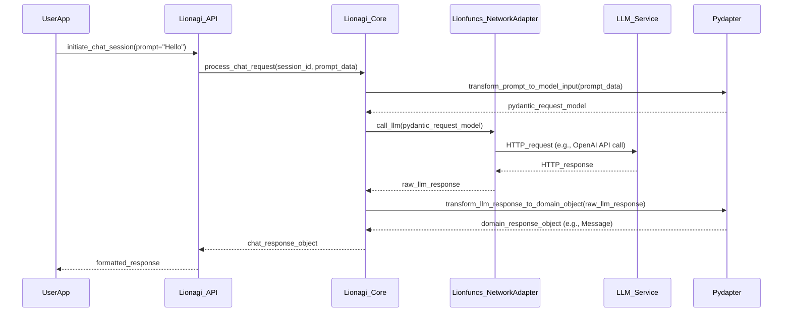
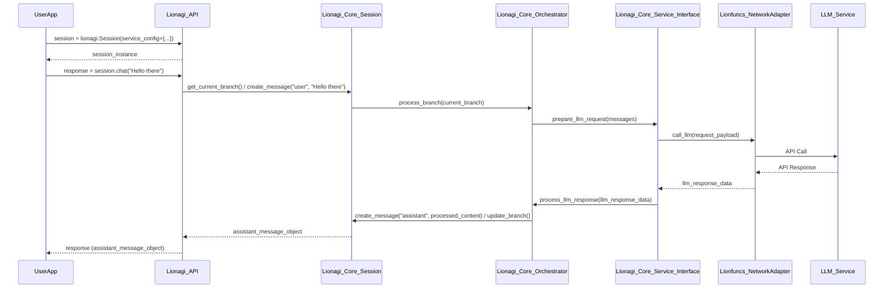
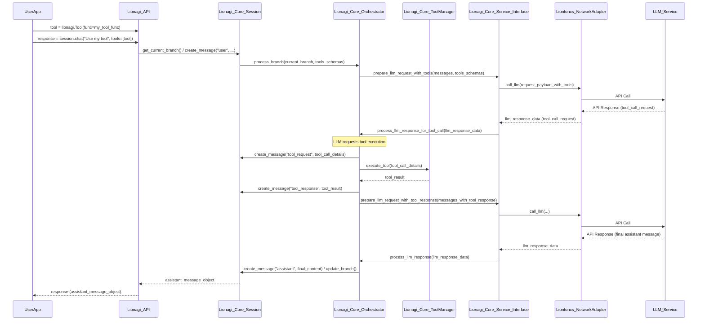

# Guidance

**Purpose**\
Lay out an **implementation-ready** blueprint for a microservice or feature:
data models, APIs, flows, error handling, security, etc.

**When to Use**

- After the Research is done, to guide the Implementer.
- Before Implementation Plan or simultaneously with it.

**Best Practices**

- Keep the design as **complete** as possible so coders can proceed with minimal
  guesswork.
- Emphasize any performance or security corners.
- Use diagrams (Mermaid) for clarity.

---

# Technical Design Specification: `lionagi` Package Refactoring

## 1. Overview

### 1.1 Purpose

This document outlines the technical design for refactoring the `lionagi` Python package. The primary goal is to transform `lionagi` into a high-level abstraction layer for building AI/LLM applications, leveraging the specialized capabilities of the `lionfuncs` and `pydapter` libraries. This refactoring aims to simplify `lionagi`'s codebase, enhance its maintainability, and provide a more focused and powerful interface for developers.

### 1.2 Scope

**In Scope:**

*   Defining the new architecture of `lionagi` as a high-level abstraction.
*   Specifying the integration of `lionfuncs` to replace functionalities in [`lionagi/utils.py`](./lionagi/utils.py:1), [`lionagi/_errors.py`](./lionagi/_errors.py:1), [`lionagi/libs/`](./lionagi/libs/:1), concurrency mechanisms, and provider-specific SDK logic in [`lionagi/service/providers/`](./lionagi/service/providers/:1).
*   Specifying the integration of `pydapter` to replace [`lionagi/adapters/`](./lionagi/adapters/:1) and enhance Pydantic model capabilities.
*   Evaluating and redesigning [`lionagi/protocols/`](./lionagi/protocols/:1) and determining the fate of [`lionagi/_class_registry.py`](./lionagi/_class_registry.py:1).
*   Addressing the relocation of "Endpoint" and "Reader" functionalities (currently in `lionagi.service.endpoints` and `lionagi.tools.file.reader` respectively) to "khive".
*   Outlining changes to core files like [`lionagi/__init__.py`](./lionagi/__init__.py:1) and [`lionagi/settings.py`](./lionagi/settings.py:1).
*   Proposing necessary changes to the `lionagi` directory structure.

**Out of Scope:**

*   Detailed implementation of every function or class.
*   Implementation of the `lionfuncs` or `pydapter` libraries themselves.
*   Full implementation details of the "khive" components that will house the relocated "Endpoint" and "Reader" functionalities (this TDS will define the interface/expectation from `lionagi`'s perspective).
*   Specific UI/UX design if `lionagi` were to be part of a larger application with a UI.

### 1.3 Background

This refactoring initiative is driven by the completion of the research phase documented in **[`RR-673-lionagi-refactor-research.md`](./.khive/reports/rr/RR-673.md:1)** (referred to as RR-673 hereafter). RR-673 confirmed that `lionfuncs` provides comprehensive utilities for async operations, file systems, network interactions (including SDK adapters), concurrency, and error handling, making it suitable to replace many existing `lionagi` components. Similarly, `pydapter` offers robust data adaptation capabilities that can replace and enhance `lionagi/adapters/`. The overall goal is to create a more modular, maintainable, and powerful `lionagi` library by leveraging these specialized underlying libraries. This redesign addresses GitHub Issue #673.

### 1.4 Design Goals

*   **High-Level Abstraction:** `lionagi` should provide a simplified, intuitive, and powerful API for common AI/LLM application development tasks, abstracting away the complexities of underlying operations.
*   **Modularity:** Clearly separate concerns by delegating low-level tasks (utilities, file I/O, network calls, data conversion) to `lionfuncs` and `pydapter`.
*   **Maintainability:** Reduce code duplication and complexity within `lionagi`, making it easier to understand, maintain, and extend.
*   **Developer Experience:** Offer a clean and well-documented API for users of `lionagi`.
*   **Focus:** `lionagi`'s core responsibility will be the orchestration of AI workflows, management of state, and interaction with LLM services, rather than implementing foundational utilities.
*   **Clarity in Relocation:** Provide a clear architectural solution for the "Endpoint" and "Reader" functionalities moving to "khive".

### 1.5 Key Constraints

*   The design must primarily utilize `lionfuncs` and `pydapter` for functionalities identified in RR-673.
*   The solution for "Endpoint" and "Reader" relocation must be architecturally sound and clearly define responsibilities.
*   Backward compatibility with the current `lionagi` API is **not** a primary constraint; the focus is on a well-reasoned new API.
*   The refactored `lionagi` must remain a Python package.

## 2. Architecture

### 2.1 High-Level Component Diagram

This diagram illustrates the conceptual layering and primary dependencies of the refactored `lionagi`.

```mermaid
graph TD
    subgraph User Application
        U[User Code]
    end

    subgraph lionagi (High-Level Abstraction Layer)
        L_API[Public API Facade: Session, Branch, Tools, Services]
        L_CORE[Core Logic: Workflow Orchestration, State Management, Protocol Implementation]
        L_CONFIG[Configuration: settings.py]
    end

    subgraph Supporting Libraries
        LF[lionfuncs: Utilities, Async, Concurrency, File I/O, Network (SDK Adapters), Errors]
        PD[pydapter: Data Adaptation, Model Mixins]
    end

    subgraph External Systems
        LLM[LLM Services: OpenAI, Anthropic, etc.]
        KHIVE[Khive System/CLI: (Hosts relocated Endpoint/Reader)]
    end

    U --> L_API
    L_API --> L_CORE
    L_CORE --> LF
    L_CORE --> PD
    L_CORE --> L_CONFIG
    L_CORE --> LLM_CLIENT[lionfuncs.network.adapters]
    LLM_CLIENT --> LLM
    L_CORE -.->|Optional Interaction / Configuration| KHIVE

    classDef lionagi fill:#D6EAF8,stroke:#3498DB,stroke-width:2px;
    classDef support fill:#E8F8F5,stroke:#1ABC9C,stroke-width:2px;
    classDef external fill:#FDEDEC,stroke:#E74C3C,stroke-width:2px;
    classDef userapp fill:#FEF9E7,stroke:#F1C40F,stroke-width:2px;

    class U userapp;
    class L_API,L_CORE,L_CONFIG lionagi;
    class LF,PD support;
    class LLM,KHIVE,LLM_CLIENT external;
```

**Explanation:**

*   **User Application:** Represents the developer's code that uses `lionagi`.
*   **`lionagi` (High-Level Abstraction Layer):**
    *   **Public API Facade:** The primary entry point for users (e.g., `Session`, `Branch` management, `Tool` integration, simplified `Service` access).
    *   **Core Logic:** Contains the intelligence for orchestrating workflows, managing conversational state, implementing high-level protocols, and interacting with LLM services via `lionfuncs`.
    *   **Configuration:** Manages settings for `lionagi` behavior.
*   **Supporting Libraries:**
    *   **`lionfuncs`:** Provides a wide array of foundational utilities, including the crucial `network.adapters` for communicating with LLM services.
    *   **`pydapter`:** Handles all data adaptation tasks, potentially via mixins in `lionagi`'s Pydantic models.
*   **External Systems:**
    *   **LLM Services:** External AI model providers.
    *   **Khive System/CLI:** The designated location for the "Endpoint" and "Reader" functionalities. `lionagi` might interact with it for configuration or if these components expose APIs `lionagi` needs to consume (TBD in detail in section 5.4).

### 2.2 Dependencies

**Core Dependencies:**

*   **`python`**: >= 3.9 (align with `pydapter` and modern practices)
*   **`lionfuncs`**: For all core utilities, async operations, file I/O, network interactions (including LLM SDKs), error handling, and concurrency. (RR-673, Section 2.1)
*   **`pydapter`**: For all data adaptation needs, replacing [`lionagi/adapters/`](./lionagi/adapters/:1). (RR-673, Section 2.2)
*   **`pydantic`**: For data modeling and validation, enhanced by `pydapter`.

**Potential/Optional Dependencies (to be confirmed during implementation):**

*   Specific SDKs if `lionfuncs.network.adapters` require them as peer dependencies (e.g., `openai`, `anthropic`). This should be clarified by `lionfuncs` documentation or its `pyproject.toml`.
*   Libraries for specific `Tool` implementations if not covered by `lionfuncs`.

**Development Dependencies:**

*   `pytest` (or chosen testing framework)
*   `ruff`, `black` (or chosen linters/formatters)
*   `pre-commit`
*   `mkdocs` (if documentation generation is kept similar)

### 2.3 Data Flow (Example: Chat Completion Request)



## 3. Interface Definitions

### 3.1 `lionagi` Public API (Conceptual)

The `lionagi` public API will be designed to be intuitive and high-level. It will primarily expose concepts like:

*   **`Session` / `Branch`:** For managing conversation history and state.
    *   `lionagi.Session()`
    *   `session.chat(message: str, tools: List[Tool] = None, **kwargs) -> Message`
    *   `session.new_branch()`
    *   `session.load_branch(branch_id)`
    *   `session.current_branch -> Branch`
    *   `branch.history -> List[Message]`
*   **`Message` objects:** Standardized representation for system, user, assistant, and tool messages. These will likely use `pydapter.Adaptable` for easy serialization/deserialization.
*   **`Tool` / `ToolManager`:** For defining and managing tools/functions that LLMs can call.
    *   `lionagi.Tool(func: Callable, schema: Optional[dict] = None)` (schema can be auto-generated by `lionfuncs.schema_utils.function_to_openai_schema`)
    *   Integration with `Session.chat` for tool use.
*   **`Service` (Simplified):** A simplified way to configure and interact with different LLM providers, abstracting `lionfuncs.network.adapters`.
    *   `lionagi.Service(provider: str, api_key: str, **provider_kwargs)`
    *   This might be implicitly managed by `Session` or explicitly configured.
*   **Configuration (`lionagi.settings`):** For global settings like default API keys, logging levels.

**Detailed API endpoints are TBD during implementation, but the focus will be on these core concepts.**

### 3.2 Internal Interfaces

*   **`lionagi.core.orchestrator`:** Module responsible for managing the flow of a conversation, including tool calls, message processing, and state updates.
*   **`lionagi.core.state_manager`:** Handles persistence and retrieval of session/branch state (potentially using `pydapter` for serialization to various backends if extended in the future, but initially in-memory or simple file-based).
*   **`lionagi.core.service_interface`:** An internal interface that `lionagi.core.orchestrator` uses to communicate with LLM services via `lionfuncs.network.adapters`. This layer will handle request/response mapping using `pydapter`.
*   **`lionagi.core.tool_executor`:** Responsible for executing registered tools and formatting their outputs.

## 4. Data Models

### 4.1 Core Pydantic Models (Leveraging `pydapter.Adaptable`)

(Examples, to be refined. Assuming `lionfuncs.utils.generate_uuid()` and `lionfuncs.time_utils.get_timestamp()` exist or similar utilities are available in `lionfuncs`.)

```python
from pydantic import BaseModel, Field
from typing import List, Dict, Any, Literal, Optional
from enum import Enum
# from pydapter.core import Adaptable # Assuming pydapter is available
# import lionfuncs.utils # For generate_uuid
# import lionfuncs.time_utils # For get_timestamp

# Placeholder for Adaptable if pydapter is not yet in the environment for linting
class Adaptable: pass

# Placeholder for lionfuncs utilities if not directly importable for linting
class lionfuncs_utils_placeholder:
    @staticmethod
    def generate_uuid(): import uuid; return str(uuid.uuid4())
    @staticmethod
    def get_timestamp(): import datetime; return datetime.datetime.now(datetime.timezone.utc).isoformat()

class RoleEnum(str, Enum):
    SYSTEM = "system"
    USER = "user"
    ASSISTANT = "assistant"
    TOOL_REQUEST = "tool_request"
    TOOL_RESPONSE = "tool_response"

class Message(BaseModel, Adaptable):
    id: str = Field(default_factory=lionfuncs_utils_placeholder.generate_uuid)
    role: RoleEnum
    sender: Optional[str] = None # e.g., tool_name for TOOL_RESPONSE or user_id
    content: Any # Can be string, or structured for tool calls/responses
    timestamp: str = Field(default_factory=lionfuncs_utils_placeholder.get_timestamp)
    metadata: Dict[str, Any] = Field(default_factory=dict)

class ToolCallRequest(BaseModel, Adaptable): # Part of Message.content if role is TOOL_REQUEST
    id: str = Field(default_factory=lionfuncs_utils_placeholder.generate_uuid)
    function_name: str
    arguments: Dict[str, Any]

class ToolCallResponse(BaseModel, Adaptable): # Part of Message.content if role is TOOL_RESPONSE
    request_id: str # Corresponds to ToolCallRequest.id
    result: Any
    is_error: bool = False
    error_message: Optional[str] = None

class Branch(BaseModel, Adaptable):
    id: str = Field(default_factory=lionfuncs_utils_placeholder.generate_uuid)
    messages: List[Message] = Field(default_factory=list)
    metadata: Dict[str, Any] = Field(default_factory=dict)

class Session(BaseModel, Adaptable):
    id: str = Field(default_factory=lionfuncs_utils_placeholder.generate_uuid)
    branches: Dict[str, Branch] = Field(default_factory=dict)
    current_branch_id: Optional[str] = None
    default_service_config: Dict[str, Any] = Field(default_factory=dict) # For LLM provider
    metadata: Dict[str, Any] = Field(default_factory=dict)
```

## 5. Detailed Design & Component Mapping

This section details how `lionagi` components will be refactored or replaced using `lionfuncs` and `pydapter`, and addresses other key design objectives.

### 5.1 Integration of `lionfuncs`

`lionfuncs` will provide the foundational utilities for `lionagi`. (RR-673, Section 2.1.2, 4.1)

*   **[`lionagi/utils.py`](./lionagi/utils.py:1):**
    *   General utilities like `is_coro_func`, `force_async`, `get_env_bool`, `get_env_dict`, `to_list`, `to_dict` will be replaced by their counterparts in `lionfuncs.utils` and `lionfuncs.async_utils`.
    *   Async utilities like `alcall`, `bcall` will be directly replaced by `lionfuncs.async_utils.alcall` and `lionfuncs.async_utils.bcall`.
    *   Any remaining specific utilities not covered by `lionfuncs` will be evaluated:
        *   If generic enough, propose addition to `lionfuncs`.
        *   If `lionagi`-specific and essential, they may reside in a minimal `lionagi.core.utils` module.
        *   Otherwise, they will be removed if redundant or obsolete.
*   **[`lionagi/_errors.py`](./lionagi/_errors.py:1):**
    *   To be replaced by the structured error hierarchy from `lionfuncs.errors` (e.g., `LionError`, `LionFileError`, `LionNetworkError`). `lionagi` will adopt these errors or subclass them for more specific contexts if needed, ensuring standardized error handling. (RR-673, Section 2.1.2)
*   **[`lionagi/libs/`](./lionagi/libs/:1) (various submodules):**
    *   **`lionagi/libs/file/`**: Replaced by `lionfuncs.file_system` (e.g., `read_file`, `save_to_file`, `chunk_content`). (RR-673, Section 2.1.2)
    *   **`lionagi/libs/parse/`**:
        *   `fuzzy_parse_json.py` -> `lionfuncs.parsers.fuzzy_parse_json`. (RR-673, Section 2.1.2)
        *   `to_dict.py` -> `lionfuncs.utils.to_dict`. (RR-673, Section 2.1.2)
        *   Other parsing utilities (e.g., `to_json`, `to_num`, `to_xml`, `xml_parser`) will be evaluated. If generic, `lionfuncs` equivalents will be sought/proposed. If specific to old `lionagi` data structures, they may become obsolete or be handled by `pydapter`.
    *   **`lionagi/libs/schema/`**:
        *   `as_readable.py` -> `lionfuncs.format_utils.as_readable`. (RR-673, Section 2.1.2)
        *   `function_to_schema.py` (for OpenAI tools) -> `lionfuncs.schema_utils.function_to_openai_schema`. (RR-673, Section 2.1.2)
        *   Other schema utilities will be reviewed for relevance or replacement by `lionfuncs`.
    *   **`lionagi/libs/validate/`**:
        *   `string_similarity.py` -> `lionfuncs.text_utils.string_similarity`. (RR-673, Section 2.1.2)
        *   `fuzzy_match_keys.py` -> `lionfuncs.dict_utils.fuzzy_match_keys`. (RR-673, Section 2.1.2)
        *   Other validation logic may be covered by Pydantic's built-in validation, `pydapter`, or specific `lionfuncs` validators.
    *   **`lionagi/libs/nested/`**, **`lionagi/libs/package/`**, **`lionagi/libs/token_transform/`**: These will be carefully reviewed. Many general-purpose nested data manipulation or package utilities might have equivalents in `lionfuncs` or Python's standard library. Token transformation logic is highly specialized; if still required, it might remain in `lionagi.core` or be a candidate for a new specialized library if complex enough.
*   **Concurrency Mechanisms:**
    *   Custom async patterns, rate limiters, and concurrency controls within `lionagi` will be replaced by robust primitives from `lionfuncs.concurrency` (e.g., `BoundedQueue`, `WorkQueue`) and `lionfuncs.async_utils` (e.g., `@max_concurrent`, `@throttle`, `CancelScope`, `TaskGroup`). (RR-673, Section 2.1.2)
*   **Provider-Specific SDK Logic in [`lionagi/service/providers/`](./lionagi/service/providers/:1):**
    *   This entire module will be refactored. The direct interaction with LLM provider SDKs or HTTP APIs will be handled by `lionfuncs.network.adapters` (e.g., `OpenAIAdapter`, `AnthropicAdapter`). (RR-673, Section 2.1.2, 4.1)
    *   `lionagi`'s `Service` layer (or `lionagi.core.service_interface`) will act as a thin wrapper or direct user of these `lionfuncs` adapters, focusing on request/response mapping (using `pydapter`) and configuration.

### 5.2 Integration of `pydapter`

`pydapter` will handle all data adaptation tasks within `lionagi`. (RR-673, Section 2.2, 4.1)

*   **[`lionagi/adapters/`](./lionagi/adapters/:1):** This entire directory will be removed and its functionality replaced by `pydapter`.
    *   `pydapter` supports JSON, CSV, TOML, pandas DataFrames, Excel, and various databases, covering and exceeding the capabilities of the current `lionagi/adapters/`. (RR-673, Section 2.2.1)
*   **Pydantic Models using `Adaptable` Mixin:**
    *   Core `lionagi` Pydantic models (like `Message`, `Session`, `Branch` defined in Section 4.1) will inherit from `pydapter.Adaptable` (or `pydapter.async_core.AsyncAdaptable` if async conversions are needed).
    *   This will allow models to have built-in methods for serialization/deserialization to/from various formats supported by `pydapter` (e.g., `model.adapt_to(obj_key="json")`, `Model.adapt_from(data, obj_key="json")`).
    *   This simplifies data handling for persistence, API interactions, and interoperability.

### 5.3 `lionagi/protocols/` and `_class_registry.py`

*   **[`lionagi/protocols/`](./lionagi/protocols/:1):**
    *   The existing protocols define various structures like `Element`, `Event`, `Pile`, `Form`, `Graph`, `Mail`, `Message` (which will be a core Pydantic model), `Operative`.
    *   **Evaluation:**
        *   Many of these protocols represent abstract data structures or interaction patterns.
        *   The underlying implementation of these protocols, especially data manipulation and state management, will benefit from `lionfuncs` (for utilities) and `pydapter` (for data representation and conversion).
        *   **Core `Message` structures** will be redesigned as Pydantic models (see Section 4.1).
        *   **High-level concepts** like `Form`, `Graph`, or `Operative` (if deemed essential for the new `lionagi`'s scope as an abstraction layer) will be re-evaluated.
            *   Their internal logic will be rebuilt using `lionfuncs` utilities.
            *   Their data representations will use Pydantic models with `pydapter` capabilities.
        *   Some protocols might be simplified or deemed out of scope if they represent overly specific or low-level concerns not fitting the "high-level abstraction" goal. For example, generic `Element`, `Event`, `Log`, `Pile`, `Processor`, `Progression` might be too granular and could be replaced by more direct Pydantic models and `lionfuncs`-driven logic within `lionagi.core`.
    *   **Recommendation:** Focus `lionagi` on core conversational and workflow orchestration protocols. Simplify or remove overly generic or low-level protocol definitions. The emphasis will be on concrete Pydantic data models and `lionagi.core` modules orchestrating them.
*   **[`lionagi/_class_registry.py`](./lionagi/_class_registry.py:1):**
    *   The class registry is often used for dynamic instantiation or lookup, potentially tied to the old protocol system or serialization.
    *   **Fate:**
        *   If the protocol system is significantly simplified and relies more on standard Pydantic models and direct imports, the need for a complex class registry might diminish.
        *   `pydapter` itself might handle some dynamic aspects of model adaptation.
        *   If a form of registry is still needed (e.g., for discoverable `Tool` classes or custom `Message` types), it should be simplified and clearly justified.
        *   **Tentative Recommendation:** Aim to remove or significantly simplify `_class_registry.py`. If specific registration needs arise (e.g., for tools), a more localized and explicit mechanism within the relevant `lionagi.core` module (e.g., `ToolManager`) will be preferred.

### 5.4 "Endpoint" and "Reader" Relocation to "khive"

This addresses a key requirement from the prompt.

*   **Current Location:**
    *   "Endpoint" functionalities are in [`lionagi/service/endpoints/`](./lionagi/service/endpoints/:1) (e.g., `ChatCompletion`, `RateLimitedProcessor`, `TokenCalculator`).
    *   "Reader" functionality is in [`lionagi/tools/file/reader.py`](./lionagi/tools/file/reader.py:1).
*   **Definition of "khive" in this context:**
    *   For the purpose of this TDS, "khive" is assumed to be a separate system or library, potentially part of the `khive` CLI's ecosystem or a new `khive-core` Python library. It is *not* part of the refactored `lionagi` package.
*   **Architectural Solution:**
    1.  **Removal from `lionagi`:** These functionalities will be entirely removed from the `lionagi` codebase.
        *   `lionagi.service.endpoints` directory will be removed.
        *   `lionagi.tools.file.reader` (and potentially the `lionagi.tools.file` module if `reader` is its only significant component) will be removed. File operations needed by `lionagi` internally will use `lionfuncs.file_system`.
    2.  **Responsibilities of "khive":**
        *   **Endpoints:** The "khive" system will be responsible for providing and managing LLM API endpoint abstractions, including aspects like rate limiting, token calculation, and potentially more complex endpoint matching logic if needed by the broader khive ecosystem.
        *   **Reader:** The "khive" system will provide advanced file reading/parsing capabilities, possibly as a tool or service that can be invoked.
    3.  **Interaction between `lionagi` and "khive" components (if any):**
        *   **Decoupling:** The primary goal is to decouple `lionagi` from these specific implementations.
        *   **`lionagi`'s LLM Interaction:** `lionagi` will interact with LLM services directly via `lionfuncs.network.adapters`. It will not depend on the "Endpoint" components previously in `lionagi.service.endpoints` for this core task.
        *   **Configuration/Discovery (Optional):** If `lionagi` needs to be aware of or configured by services provided by "khive" (e.g., a central token calculator service, or a specific file reading service that a `Tool` might use), this would occur via:
            *   Configuration passed to `lionagi.Session` or `lionagi.Service`.
            *   A well-defined API exposed by the "khive" component, which a `lionagi` `Tool` could call.
        *   **File Reading within `lionagi`:** If `lionagi` itself needs to read files for its core operations (e.g., loading a configuration, a prompt template from a file), it will use `lionfuncs.file_system` directly. The "Reader" relocation refers to the more advanced, tool-like file reading capabilities.
*   **Clarity:** `lionagi` will no longer bundle these specific "Endpoint" management or "Reader" tool implementations. Users requiring such functionalities will look to the "khive" ecosystem.

### 5.5 Impact on Core Files

*   **[`lionagi/__init__.py`](./lionagi/__init__.py:1):**
    *   Exports will be significantly updated to reflect the new public API.
    *   Will primarily export core classes like `Session`, `Message`, `Tool`, `Branch`, and potentially a simplified `Service` configuration entry point.
    *   Exports from `utils`, `libs`, `adapters`, `service.providers`, `service.endpoints` will be removed.
*   **[`lionagi/settings.py`](./lionagi/settings.py:1):**
    *   Configurations related to internal components being removed (e.g., specific paths within `libs`, old adapter settings) will be removed.
    *   May retain settings for default API keys (though these are better managed via environment variables or direct `Service` configuration), logging levels, and any new `lionagi`-specific configurations.
    *   If `lionfuncs` or `pydapter` have their own configuration mechanisms that `lionagi` needs to influence, `settings.py` might provide a way to pass these through, but ideally, those libraries are configured independently or via `lionagi.Service` parameters.
    *   The role of `settings.py` might diminish in favor of explicit configuration objects passed during `Session` or `Service` instantiation.

### 5.6 Proposed Directory Structure for `lionagi`

The directory structure will be significantly leaner:

```
lionagi/
├── __init__.py
├── version.py
├── settings.py         # Core lionagi settings (potentially minimal)
│
├── core/               # Internal logic for lionagi
│   ├── __init__.py
│   ├── orchestrator.py # Manages conversation flow, tool calls
│   ├── state_manager.py  # Manages session/branch state
│   ├── service_interface.py # Internal interface to lionfuncs.network.adapters
│   ├── tool_manager.py   # Manages tool registration and execution
│   └── utils.py          # Minimal, lionagi-specific utilities (if any)
│
├── models/             # Core Pydantic data models (Message, Session, Branch, etc.)
│   ├── __init__.py
│   ├── base.py           # Potentially a base model for all lionagi models
│   ├── message.py
│   ├── session.py
│   └── ...               # Other core models
│
├── tools/              # Built-in high-level tools (if any, distinct from user-defined tools)
│   ├── __init__.py     # Example: A simple web search tool wrapper
│   └── web_search_tool.py
│
└── py.typed            # For PEP 561 compliance
```

**Removed Directories:**

*   `lionagi/adapters/` (Replaced by `pydapter`)
*   `lionagi/libs/` (Functionality moved to `lionfuncs` or obsolete)
*   `lionagi/_errors.py` (Replaced by `lionfuncs.errors`)
*   `lionagi/service/providers/` (Replaced by `lionfuncs.network.adapters`)
*   `lionagi/service/endpoints/` (Relocated to "khive")
*   `lionagi/protocols/` (Functionality absorbed into `lionagi.core` and `lionagi.models`, or simplified/removed)
*   `lionagi/_class_registry.py` (Likely removed or significantly simplified)

## 6. Behavior

### 6.1 Core Workflows

#### 6.1.1 Session Initialization and Chat



#### 6.1.2 Chat with Tool Use



## 7. Error Handling

*   **Primary Reliance on `lionfuncs.errors`:** `lionagi` will catch and handle errors from `lionfuncs` (e.g., `LionNetworkError`, `LionFileError`) when performing underlying operations. (RR-673, Section 2.1.2)
*   **`pydapter` Exceptions:** Data adaptation errors from `pydapter` (e.g., `AdapterError`, `ValidationError`, `ParseError`) will be handled during model serialization/deserialization. (RR-673, `pydapter` README Appendix C)
*   **`lionagi`-Specific Exceptions:** `lionagi` may define a small set of its own exceptions, inheriting from `lionfuncs.LionError`, for application-level issues not covered by the underlying libraries (e.g., `LionagiSessionError`, `LionagiToolNotFoundError`, `LionagiConfigurationError`).
*   **Tool Execution Errors:** Errors during the execution of user-provided tools will be caught by `lionagi.core.tool_executor`, packaged into a `ToolCallResponse` with `is_error=True`, and sent back to the LLM.
*   **Clear Error Propagation:** Errors from LLM services (e.g., API errors, rate limits) captured by `lionfuncs.network.adapters` will be propagated transparently or wrapped in `lionagi`-specific exceptions for the user to handle.

## 8. Security Considerations

*   **API Key Management:** Secure handling of LLM API keys is paramount. `lionagi` will delegate API key management to `lionfuncs.network.adapters`. These adapters should support secure methods for key provision (e.g., environment variables, secure configuration). `lionagi` itself will not store API keys directly in its state or models unless explicitly configured for a specific `Service` instance by the user.
*   **Tool Security:**
    *   `lionagi` executes user-defined Python callables as tools. Users are responsible for the security of the code within these tools.
    *   `lionagi` will not, by default, provide tools that perform arbitrary code execution from LLM-generated strings unless explicitly designed as such by the user (e.g., a "python interpreter" tool).
    *   Input from LLMs intended as arguments for tools should be validated by the Pydantic schemas of the tools themselves.
*   **Data Handling:** Sensitive data passed to or received from LLMs should be handled according to best practices. `lionagi` itself does not add extra layers of encryption beyond what `lionfuncs` might provide for network traffic (HTTPS) or what `pydapter` might support for specific database adapters. Users are responsible for ensuring end-to-end security if required.
*   **Dependency Management:** Relying on `lionfuncs` and `pydapter` means `lionagi` inherits their security posture regarding their own dependencies. Regular updates and vulnerability scanning of all dependencies (including transitive ones) are important.

## 9. Performance Considerations

### 9.1 Expected Load
*   `lionagi` is a library, so load characteristics depend on how it's used by the application.
*   Key performance-sensitive operations involve LLM calls (network latency) and potentially large data processing for tools or state management.

### 9.2 Scalability Approach
*   **Async Operations:** The core of `lionagi` will be asynchronous, leveraging `lionfuncs.async_utils` and `asyncio`. This allows for concurrent LLM calls and non-blocking tool executions, improving throughput for applications making multiple simultaneous requests.
*   **`lionfuncs` Performance:** `lionagi`'s performance for I/O-bound tasks (network, file system) will largely depend on the efficiency of `lionfuncs`.
*   **`pydapter` Performance:** Data adaptation performance will depend on `pydapter`'s efficiency for chosen formats.
*   **Statelessness (where possible):** `lionagi.core` components should aim to be stateless where feasible, with state managed by `Session`/`Branch` objects. This can aid scalability if user applications need to distribute `lionagi` workloads.

### 9.3 Optimizations
*   Minimize data copying.
*   Efficient serialization/deserialization via `pydapter`.
*   Leverage `lionfuncs`'s optimized utilities.
*   Batching of LLM requests if supported by `lionfuncs.network.adapters` and applicable to the use case.

### 9.4 Caching Strategy
*   `lionagi` itself will not implement a generic caching layer for LLM responses.
*   Caching can be implemented at the application level if needed.
*   `lionfuncs.network.adapters` might offer HTTP caching capabilities; if so, `lionagi` could expose configuration for it.

## 10. Observability

### 10.1 Logging
*   `lionagi` will use standard Python `logging`.
*   It will provide meaningful log messages for key events: session creation, chat requests, tool calls, errors, LLM interactions.
*   Log levels will be configurable.
*   It will integrate with `lionfuncs.logging` if that library provides enhanced logging capabilities or context propagation.
*   Sensitive information (e.g., full message content, API keys) should be redacted or logged only at `DEBUG` levels, configurable by the user.

### 10.2 Metrics
*   `lionagi` itself will not expose a metrics endpoint.
*   Applications using `lionagi` can implement their own metrics collection around `lionagi` API calls (e.g., number of chat requests, tool executions, errors).
*   `lionfuncs.network.adapters` might expose metrics related to LLM API calls (latency, status codes), which `lionagi` could potentially relay or make accessible.

### 10.3 Tracing
*   No built-in distributed tracing support in `lionagi`.
*   Applications can integrate tracing (e.g., OpenTelemetry) by instrumenting calls to `lionagi`'s public API.
*   If `lionfuncs` supports context propagation for tracing, `lionagi` should ensure it doesn't break it.

## 11. Testing Strategy

### 11.1 Unit Testing
*   Focus on testing individual components within `lionagi.core` (orchestrator, state manager, tool manager, service interface) with mocked dependencies (`lionfuncs`, `pydapter`, LLM responses).
*   Test Pydantic models in `lionagi.models` for validation and `pydapter` integration (if mockable).
*   Test utility functions in `lionagi.core.utils` (if any).

### 11.2 Integration Testing
*   Test core workflows (chat, tool use) with actual (but potentially mocked at a higher level) `lionfuncs` and `pydapter` interactions.
*   Test interaction with mocked LLM API responses to verify request/response handling.
*   Test `lionagi`'s error handling for exceptions raised by `lionfuncs` and `pydapter`.

### 11.3 Performance Testing
*   Not a primary focus for `lionagi` library testing itself, but benchmarks for key operations (e.g., processing a sequence of chat messages with tool calls) could be useful. Performance largely depends on underlying libraries and LLM services.

## 12. Deployment and Configuration

### 12.1 Deployment Requirements
*   `lionagi` will be a Python package distributed via PyPI.
*   Dependencies (`lionfuncs`, `pydapter`, `pydantic`, etc.) will be specified in `pyproject.toml`.

### 12.2 Configuration Parameters
*   **LLM Service Configuration:**
    *   API keys: Expected to be managed via environment variables or passed directly when configuring a `Service` or `Session`. `lionfuncs.network.adapters` will handle the actual use of these keys.
    *   Provider-specific parameters (model name, temperature, etc.): Passed via `Service` or `Session` configuration, ultimately flowing to `lionfuncs.network.adapters`.
*   **`lionagi` Behavior:**
    *   Logging levels (via `lionagi.settings` or standard Python logging configuration).
    *   Default behaviors (e.g., default tool error handling strategy) if any.
*   **`pydapter` Configuration:** If `pydapter` requires specific configuration for certain adapters that `lionagi` uses, this might be exposed through `lionagi`'s model adaptation methods or global settings if applicable.
*   **`lionfuncs` Configuration:** Similarly, if `lionfuncs` components used by `lionagi` (e.g., `AsyncAPIClient` from `lionfuncs.network`) require configuration, `lionagi` will provide a way to pass these, likely during `Service` or `Session` setup.

Example (conceptual `lionagi.settings` or environment variables):
```python
# lionagi/settings.py or environment variables
LIONAGI_LOG_LEVEL = "INFO"
# API keys are better handled by lionfuncs/environment
# OPENAI_API_KEY = "your_key_here" # (Handled by lionfuncs)
```

## 13. Risks and Mitigations

1.  **Risk:** Gaps in `lionfuncs` or `pydapter` functionality compared to existing `lionagi/libs/` or `lionagi/adapters/` that were not fully identified in RR-673.
    *   **Mitigation:** During implementation, if a critical utility is missing, evaluate:
        *   Can it be implemented using existing `lionfuncs`/`pydapter` primitives?
        *   Is it generic enough to propose for addition to `lionfuncs`/`pydapter`?
        *   If highly specific and essential to `lionagi`, it might temporarily reside in `lionagi.core.utils` with a TODO to upstream or refactor.
2.  **Risk:** Complexity in integrating the new `Tool` mechanism, especially ensuring seamless schema generation (via `lionfuncs.schema_utils.function_to_openai_schema`) and execution flow.
    *   **Mitigation:** Thorough unit and integration testing of the `ToolManager` and its interaction with the `Orchestrator` and `Service Interface`. Clear documentation for users on how to define and use tools.
3.  **Risk:** Defining a clear and intuitive public API for `lionagi` that effectively abstracts the underlying libraries without being too restrictive or too leaky.
    *   **Mitigation:** Iterative API design with feedback. Focus on common use cases first. Prioritize simplicity and ease of use.
4.  **Risk:** The "Endpoint" and "Reader" relocation to "khive" might lead to integration challenges if the "khive" components are not yet defined or their APIs are unclear.
    *   **Mitigation:** This TDS defines `lionagi`'s stance as largely decoupled. If future interaction is needed, it will be via well-defined interfaces or configuration, minimizing tight coupling. This risk is primarily external to `lionagi`'s refactoring.
5.  **Risk:** Performance bottlenecks if `lionfuncs` or `pydapter` have unexpected performance issues for `lionagi`'s use cases.
    *   **Mitigation:** Performance testing of critical paths during/after implementation. Since these are foundational libraries, performance issues should ideally be addressed within them. `lionagi` can contribute to identifying such issues.

## 14. Open Questions

1.  **Final list of `lionagi/libs/` utilities:** A definitive list of utilities from `lionagi/libs/nested/`, `lionagi/libs/package/`, and especially `lionagi/libs/token_transform/` that are still essential for `lionagi`'s core logic and do not have direct `lionfuncs` equivalents. Decision path:
    *   Can they be reimplemented using `lionfuncs` primitives?
    *   Are they truly core to `lionagi`'s new role, or can they be deprecated/moved to application layer?
    *   If essential and unique, temporarily place in `lionagi.core.utils` and flag for potential upstreaming to `lionfuncs`.
2.  **`lionagi.Service` API Detail:** The exact API for `lionagi.Service` (or its equivalent for configuring LLM provider interactions) needs to be finalized. How will users specify different `lionfuncs.network.adapters` and their specific configurations (e.g., base URLs for self-hosted models)?
3.  **State Management Persistence:** The initial design assumes in-memory or simple file-based state management for `Session`/`Branch` objects (using `pydapter` for serialization). Are there requirements for more advanced, pluggable persistence backends in the first version of the refactored `lionagi`? If so, `pydapter`'s database adapters could be leveraged, but this would expand scope. For now, assume simple serialization.
4.  **Necessity of `lionagi/tools/` directory:** The proposed structure includes a `lionagi/tools/` for potentially built-in high-level tools. Is this necessary, or should `lionagi` only focus on the mechanism for *user-defined* tools? If kept, what would be examples of such built-in tools?

## 15. Appendices

### Appendix A: Alternative Designs
(None at this stage, the design is heavily guided by RR-673 and the goal of leveraging `lionfuncs` and `pydapter`.)

### Appendix B: Research References
*   [`RR-673-lionagi-refactor-research.md`](./.khive/reports/rr/RR-673.md:1)
*   GitHub Issue #673 (https://github.com/khive-ai/lionagi/issues/673)
*   (Implicit) `lionfuncs` documentation (as referenced in RR-673)
*   (Implicit) `pydapter` documentation (as referenced in RR-673)